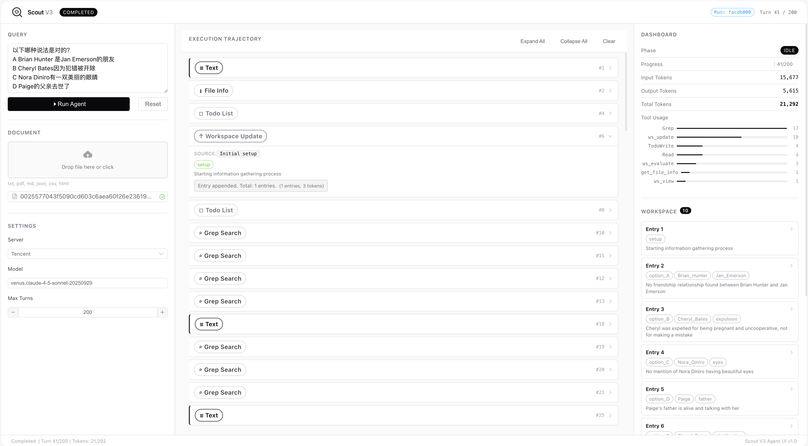

<p align="center">
  
</p>

<h1 align="center">Scout (Open-Source)</h1>

<h3 align="center">
  Active Information Foraging for Long-Text Understanding<br>with Decoupled Epistemic States
</h3>

<p align="center">
  <a href="https://xavierzhang2002.github.io/SCOUT-page/"></a>
  
  
  
</p>

<p align="center">
  <a href="https://xavierzhang2002.github.io/SCOUT-page/">Paper & Project Page</a> &bull;
  <a href="#about-this-repo">About This Repo</a> &bull;
  <a href="#quick-start">Quick Start</a> &bull;
  <a href="#configuration">Configuration</a> &bull;
  <a href="#web-ui">Web UI</a> &bull;
  <a href="#architecture">Architecture</a>
</p>

<p align="center">
  
</p>

---

## About This Repo

The Scout Agent described in our paper is built on an **enterprise-internal agent framework** with no current plans for open-source release. However, to promote community development and reproducibility, we re-implemented Scout using the **[Claude Agent SDK](https://github.com/anthropics/claude-agent-sdk-python)** — a free, publicly available agent development framework.

**This repository is that open-source implementation.**

The core methodology remains identical:
- Active information foraging (vs. passive full-text processing)
- Decoupled epistemic states (interaction history H_t separated from verified knowledge E_t)
- Three-phase foraging strategy (Orient → Forage → Verify)
- Gap-diagnosed convergence via sufficiency evaluation

Due to differences between the two agent frameworks, there are some implementation-level distinctions (e.g., behavioral enforcement via SDK Hooks instead of framework-native policies). Through testing, **this open-source version achieves performance comparable to the original**.

---

## Quick Start

### 1. Install

```bash
git clone https://github.com/XavierZhang2002/scout-open.git
cd scout-open

conda create -n scout python=3.12 -y
conda activate scout

pip install -r requirements.txt
```

### 2. Configure

```bash
cp config.example.yaml config.yaml
vim config.yaml   # Fill in your API credentials
```

Minimum configuration:

```yaml
api:
  base_url: "http://localhost:3456"       # Claude Code Router (see below)
  auth_token: "your-token"
  model: "venus,deepseek-v3.1-terminus"   # "provider,model" format
```

### 3. Run

```bash
# Single query mode
python main.py --query "What is the net profit for 2023?" --cwd /path/to/docs

# With Web UI (recommended for interactive use)
cd ui && python start.py
```

**Python API:**

```python
import anyio
from scout.config import load_config
from scout.agent import query_agent

config = load_config("config.yaml")
config.cwd = "/path/to/documents"

result, tiktoken_usage, api_usage, num_turns, tool_usage = anyio.run(
    query_agent,
    "What is the main conclusion of this paper?",
    None, None, None,
    config,
)

print(f"Answer: {result}")
print(f"Turns: {num_turns}, Tokens: {tiktoken_usage}")
```

---

## Configuration

All configuration lives in a single `config.yaml` file at the project root. Copy `config.example.yaml` to get started.

| Section | Purpose |
|---------|---------|
| `api` | LLM connection (base_url, auth_token, model) |
| `eval` | Evaluation LLM (optional, for workspace_evaluate fallback) |
| `agent` | Behavior control (max_turns, planner/evaluator toggles) |
| `tools` | Tool parameters (token thresholds, tokenizer model) |
| `pricing` | Cost estimation (optional) |

### LLM Backend Options

Scout needs an **Anthropic Messages API-compatible** endpoint. You have two options:

**Option A: Direct API** — If you have access to Claude API or any compatible endpoint, point `base_url` directly at it.

**Option B: Claude Code Router (included)** — A local proxy that converts Anthropic Messages API requests into OpenAI/other formats, enabling use of DeepSeek, Qwen, GPT, Gemini, and more:

```bash
cd proxy && bash deploy.bash   # Starts proxy on localhost:3456
```

The `model` field uses `"provider,model_name"` format for routing:
- `"venus,deepseek-v3.1-terminus"` — Route to Venus platform
- `"ds,deepseek-chat"` — Route to DeepSeek API directly
- `"openrouter,anthropic/claude-sonnet-4.5"` — Route via OpenRouter

See [proxy/README.md](proxy/README.md) for full setup guide.

### CLI Options

| Flag | Description |
|------|-------------|
| `--config PATH` | Path to config.yaml |
| `--model MODEL` | Override model |
| `--cwd DIR` | Working directory (where documents live) |
| `--query TEXT` | Single query (omit for interactive) |
| `--max-turns N` | Maximum agent turns |
| `--no-planner` | Disable Planner SubAgent |
| `--no-evaluator` | Disable Evaluator SubAgent |

---

## Web UI

Scout includes a web interface for interactive document querying with real-time agent visualization.

<p align="center">
  
</p>

```bash
cd ui
python start.py                # http://localhost:8080
python start.py --port 9000    # Custom port
```

Features:
- File upload (.txt, .pdf, .md, .json, .csv, .html, .xml, .log)
- Real-time WebSocket event stream (thinking, tool calls, results)
- Workspace viewer (inspect the agent's epistemic state)
- Configuration panel & metrics dashboard

---

## Architecture

```
scout-open/
├── main.py                     # CLI entry point
├── config.example.yaml         # Configuration template
├── scout/                      # Core agent package
│   ├── agent.py               # query_agent() — execution loop
│   ├── config.py              # ScoutConfig + load_config()
│   ├── mcp_server.py          # 6 MCP tools
│   ├── hooks/                 # 4 behavioral hooks
│   │   ├── read_guard.py      # Pre-read file safety check
│   │   ├── auto_record_reminder.py
│   │   ├── eval_guard.py      # Must-evaluate-before-stop
│   │   └── token_tracker.py
│   ├── prompts/               # 11 modular prompt files
│   ├── agents/                # Planner + Evaluator SubAgents
│   ├── tools/                 # Tool implementations
│   ├── sessions/              # Checkpoint/resume (optional)
│   └── permissions/           # Tool access control
├── ui/                        # Web UI (FastAPI + Vue 3)
├── proxy/                     # Claude Code Router (optional)
└── docs/
    └── differences.md         # Open-source vs. paper version comparison
```

### Hooks (Behavioral Enforcement)

| Hook | Trigger | Effect |
|------|---------|--------|
| `read_guard` | Before Read/Grep | Auto-checks file size; injects warnings for large files |
| `auto_record_reminder` | After Read/Grep | Reminds agent to record findings to workspace |
| `eval_guard` | After tools + on Stop | Blocks premature stopping without sufficiency evaluation |
| `token_tracker` | After all tools | Records call counts and output sizes |

### SubAgents

- **Planner** — Analyzes the query, decomposes into sub-tasks and search strategies
- **Evaluator** — Reviews the workspace, determines if collected information is sufficient

---

## Acknowledgments

- [Claude Agent SDK](https://github.com/anthropics/claude-agent-sdk-python) — The agent framework powering this open-source implementation
- [Claude Code Router](https://github.com/musistudio/claude-code-router) — API routing proxy (bundled in `proxy/`)

---

## License

MIT

---

<p align="center">
  <sub>Built for the long-context reasoning community</sub>
</p>
